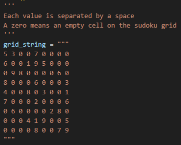
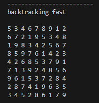

# Sudoku-Solver
This was a university AI project where I had to implement different constraint satisfaction problem methods and use them to solve sudoku puzzles. I implemented additional methods for fun.

Methods:

- backtracking
- forward checking
- arc consistency
- minimum remaining value
- least constraining value

 
